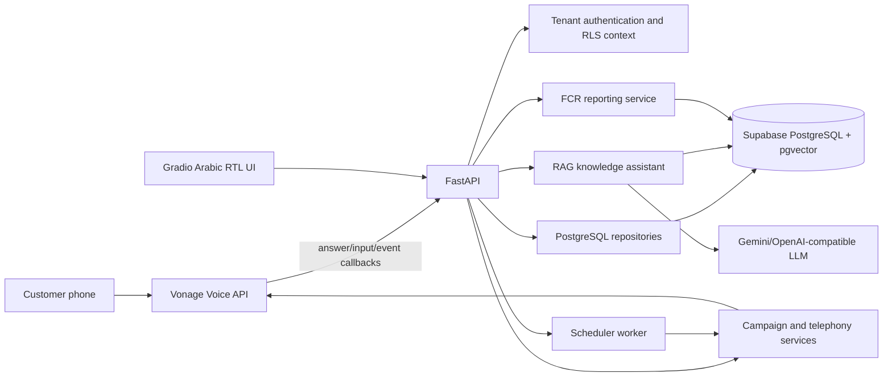

# Arabic AI-Powered Outbound Calls
## Presentation Architecture and Agentic-AI Comparison Guide

**Purpose.** This guide explains the final Vonage-first project in presentation language: what each major folder and file does, how the components connect, why the architecture was chosen, and how the current deterministic workflow compares with an agentic-AI pipeline based on tools such as LangGraph and LangSmith.

---

## 1. The one-minute project explanation

This project is a **multi-tenant Arabic customer follow-up platform**. An organization stores customers, support cases, and organization-specific knowledge documents. A scheduled follow-up task causes the system to place an outbound call through Vonage. The call asks the customer whether the previous issue was resolved. The result is stored as an auditable call transcript and business outcome. If the issue remains unresolved or the answer is ambiguous, the system creates a human-agent escalation instead of transferring the call live.

Afterward, a human agent can open the organization’s escalation queue and use an organization-scoped retrieval-augmented assistant to understand the case and consult internal documents. Managers can generate first-call-resolution reports from SQL aggregates.

The important design decision is that **the call outcome and reports are deterministic and auditable**, while the LLM is used in a bounded way for the human agent’s knowledge assistant. The system does not allow an unconstrained LLM to decide whether a customer was resolved, calculate official KPIs, or access another organization’s documents.

> The platform is an AI-assisted, policy-controlled workflow rather than an autonomous agent that is allowed to make unrestricted decisions.

---

## 2. High-level architecture



The project has two running application processes and one optional worker. **FastAPI** exposes APIs and Vonage webhooks. **Gradio** is the user interface. The **scheduler** periodically claims due follow-up tasks and starts calls. Supabase provides PostgreSQL, pgvector, Row Level Security, and private Storage.

---

## 3. Final repository structure

```text
Arabic_AI_Powered_Outbound_Calls/
├── src/outbound_ai/                 # Main Python application package
├── supabase/migrations/             # Versioned database schema and RLS changes
├── supabase/seed.sql                # Development seed data
├── tests/                           # Unit and database-contract tests
├── scripts/run_scheduler.py         # Background follow-up worker entrypoint
├── docs/                            # Requirements, deployment, audit, and presentation docs
├── Dockerfile                       # Container image definition
├── docker-compose.yml               # API, Gradio, and scheduler services
├── pyproject.toml                   # Python package and build metadata
├── requirements.txt                 # Runtime installation requirements
├── requirements-dev.txt             # Development/test requirements
├── .env.example                     # Safe configuration template
├── .gitignore                       # Prevents secrets and generated files from Git
└── README.md                        # Project overview and operating instructions
```

The project uses a `src` layout so the installable application code is separated from tests, documentation, scripts, and deployment files. This prevents accidental imports from the repository root and makes Docker and package installation more predictable.

---

## 4. The `src/outbound_ai` package

### 4.1 `api/`: HTTP boundary and webhooks

```text
src/outbound_ai/api/
├── app.py
├── auth.py
└── routers/
    ├── admin.py
    ├── agent.py
    ├── auth_ui.py
    ├── campaign.py
    ├── documents.py
    ├── reports.py
    └── vonage.py
```

| File | Responsibility | Connection |
|---|---|---|
| `api/app.py` | Creates the FastAPI application and mounts routers. | This is the HTTP composition root. It connects `/vonage`, `/campaign`, `/agent`, `/documents`, `/reports`, `/admin`, and `/auth`. |
| `api/auth.py` | Verifies Supabase JWTs and creates `TenantContext`. | Every authenticated user-facing operation receives actor ID, organization ID, and role. |
| `routers/admin.py` | Creates organizations, lists members, and sends invitations. | Enforces the hierarchy: platform administrator → organization administrator → agent. |
| `routers/agent.py` | Runs the knowledge assistant and manages human escalations. | Calls `agents/kb_assist.py` and `db/repositories/escalations.py`. |
| `routers/auth_ui.py` | Provides invitation password setup and session endpoints. | Connects Supabase invitation links to the login-first Gradio workspace. |
| `routers/campaign.py` | Lists customers/cases, schedules follow-ups, starts calls, and supports development simulation. | Calls campaign repositories and `telephony/service.py`. |
| `routers/documents.py` | Accepts organization document uploads. | Calls the ingestion and Storage pipeline with tenant context. |
| `routers/reports.py` | Exposes the FCR report endpoint. | Calls `reports/agent.py`, which delegates to the deterministic report service. |
| `routers/vonage.py` | Handles Vonage answer, input, and lifecycle-event callbacks. | Writes turns/events, applies routing, updates calls, and settles follow-up tasks. |

The routers do not contain the entire business logic. They validate the request, obtain authentication context, call a service or repository, and return an HTTP response. This separation keeps provider callbacks and UI requests testable.

### 4.2 `config/`: typed configuration

```text
src/outbound_ai/config/settings.py
```

`settings.py` loads environment variables through Pydantic settings and exposes typed configuration for database access, Supabase, authentication, Vonage, Gemini/OpenAI-compatible LLM access, embeddings, RAG thresholds, Storage, and runtime behavior.

The active telephony choices are intentionally limited to:

```dotenv
TELEPHONY_PROVIDER=vonage
```

or:

```dotenv
TELEPHONY_PROVIDER=simulated
```

Vonage production settings include the application ID, private-key path, public-key path, Vonage caller number, webhook base URL, and webhook verification setting. Secrets are never hard-coded in Python.

### 4.3 `common/`: reusable cross-cutting utilities

```text
src/outbound_ai/common/arabic.py
```

This module normalizes Arabic text for comparison and search. It handles normalization before routing or lexical retrieval, while the original customer text remains stored for auditability.

### 4.4 `db/`: database connection and repositories

```text
src/outbound_ai/db/
├── connection.py
└── repositories/
    ├── agent.py
    ├── calls.py
    ├── escalations.py
    ├── followups.py
    ├── knowledge.py
    └── organizations.py
```

`connection.py` creates the PostgreSQL connection pool and defines `TenantContext`. Every user-facing transaction sets transaction-local values such as `app.current_user_id` and `app.current_org_id`, then switches to the authenticated database role. PostgreSQL RLS policies use these values to enforce tenant isolation.

The repositories are intentionally small data-access modules:

| Repository | Main data responsibility |
|---|---|
| `organizations.py` | Organizations, memberships, invitations, and hierarchy checks. |
| `calls.py` | Call creation, provider IDs, statuses, durations, provider events, call turns, outcomes, and escalations. |
| `followups.py` | Claiming scheduled tasks, completion, retry/backoff, and terminal settlement. |
| `knowledge.py` | Document chunks, vector search, full-text search, hybrid ranking, and document metadata. |
| `agent.py` | Agent conversations, messages, citations, and audit events. |
| `escalations.py` | Pending escalation list and human resolution updates. |

There are two database paths. **User-facing requests** use RLS-enforced transactions. **Verified provider callbacks** use a trusted transaction only after the callback is authenticated and the internal call is resolved by provider ID. This distinction is important because Vonage does not carry a browser user’s Supabase JWT in its webhook request.

### 4.5 `telephony/`: provider-independent call orchestration

```text
src/outbound_ai/telephony/
├── base.py
├── prompts.py
├── routing.py
├── scheduler.py
├── service.py
├── simulated.py
└── vonage.py
```

| File | Responsibility |
|---|---|
| `base.py` | Defines the provider-neutral request/result contract. |
| `prompts.py` | Stores reusable Egyptian-Arabic greeting, question, resolved, and escalation prompts. |
| `service.py` | Chooses Vonage or simulated mode, creates the internal call row, calls the provider, and stores the provider call ID. |
| `vonage.py` | Generates the Vonage JWT, creates the outbound call, builds answer/input/event URLs, and normalizes phone numbers. |
| `simulated.py` | Creates development calls without contacting a carrier. |
| `routing.py` | Applies explicit Arabic phrase/word matching and precedence rules to classify the customer response. |
| `scheduler.py` | Claims due follow-up tasks and invokes the telephony service with retry/backoff. |

The current call state machine is deliberately explicit:

```text
SCHEDULED
   ↓ claim
IN_PROGRESS
   ↓ provider accepted
INITIATED / RINGING / ANSWERED
   ↓ terminal callback
COMPLETED / NO_ANSWER / BUSY / FAILED
   ↓ business decision
ANSWERED_RESOLVED or ESCALATED
```

The call is not marked complete merely because Vonage accepted the request. The follow-up task is settled only after a terminal provider event. This prevents no-answer calls from disappearing.

### 4.6 `rag/`: document ingestion and retrieval

```text
src/outbound_ai/rag/
├── chunking.py
├── embeddings.py
├── ingestion.py
├── loaders.py
├── retrievers/
└── upload.py
```

`loaders.py` extracts text from supported documents. `chunking.py` creates Arabic-aware chunks. `embeddings.py` exposes an embedding interface with production OpenAI mode and deterministic test mode. `ingestion.py` combines loading, chunking, embedding, database insertion, and Storage metadata. `knowledge.py` performs hybrid pgvector and PostgreSQL full-text retrieval.

The key rule is that **all documents are retrieved with organization scope**. The RAG assistant never searches globally; the active `TenantContext` is passed into the repository and the database policies provide a second protection layer.

### 4.7 `agents/`: bounded knowledge assistant

```text
src/outbound_ai/agents/kb_assist.py
```

This is an **LLM-assisted RAG component**, not an autonomous agentic loop. It performs the following deterministic sequence:

```text
question
  ↓
create/check conversation ownership
  ↓
embed question
  ↓
hybrid organization-scoped retrieval
  ↓
construct evidence with citations
  ↓
call Gemini/OpenAI-compatible chat model
  ↓
store user message, answer, citations, and audit event
```

The LLM is instructed to use only retrieved evidence. It is not allowed to query another organization or invent policy. When no model is configured, the system returns an offline fallback response.

### 4.8 `reports/`: reporting agent facade and deterministic metrics

```text
src/outbound_ai/reports/
├── agent.py
└── service.py
```

`service.py` performs the authoritative SQL aggregation. It calculates total calls, answered calls, resolved calls, escalations, answer rate, FCR rate, and average duration.

`agent.py` is named a reporting-agent facade because it presents the report as a stable Arabic reporting object and supplies recommendations. It is **not a LangGraph autonomous reporting agent**. The important design principle is that official KPIs come from SQL, not from an LLM. An LLM may later explain the report in natural language, but it should not recalculate the counts.

### 4.9 `observability/`: privacy-safe logs

```text
src/outbound_ai/observability/logging.py
```

This module uses standard Python logging with redaction for authorization headers, tokens, and sensitive values. It records operational events such as call dispatch, callback processing, agent responses, and errors without writing secrets or unnecessary customer data to logs.

### 4.10 `ui/`: Gradio Arabic RTL workspace

```text
src/outbound_ai/ui/app.py
```

`app.py` is the login-first Gradio application. It stores the session token and selected organization in the UI state, then calls the FastAPI endpoints. Its role-aware tabs cover campaign management, agent escalations and RAG, document upload, reports, and administration.

The UI is intentionally a client of the API rather than a second business-logic implementation. This means the same tenant rules apply whether a user acts through Gradio or through an API client.

### 4.11 `graph/`, `prompts/`, and `schemas/`

The final tree still contains minimal package placeholders such as:

```text
src/outbound_ai/graph/__init__.py
src/outbound_ai/prompts/__init__.py
src/outbound_ai/schemas/__init__.py
```

They are reserved extension points. `graph/` is not an implemented LangGraph workflow. `prompts/` is reserved for future prompt-template organization, while the current phone prompts live in `telephony/prompts.py`. `schemas/` can later contain shared Pydantic request/response models; current routers use local request models where appropriate.

---

## 5. Database and RLS structure

The database migrations are applied in order:

| Migration | Purpose |
|---|---|
| `202608160001_initial_schema.sql` | Core tables, enums, indexes, helper functions, RLS policies, and Storage support. |
| `202608160002_add_call_duration.sql` | Adds call duration persistence. |
| `202608160003_hybrid_knowledge_search.sql` | Adds hybrid vector/full-text search functions. |
| `202608160004_grant_private_helper_execution.sql` | Grants the authenticated role permission to use private RLS/search helpers. |
| `202608190005_allow_authorized_call_creation.sql` | Allows authorized tenant members to insert calls while preserving organization and case consistency. |

The central tenant relationship is:

```text
organization
 ├── organization_memberships
 ├── customers
 │    └── support_cases
 │         └── follow_up_tasks
 │              └── calls
 │                   ├── call_turns
 │                   ├── call_events
 │                   └── escalations
 └── knowledge_documents
      └── knowledge_chunks
```

A platform administrator can manage organizations. An organization administrator manages users and data inside that organization. An agent sees only assigned or organization-authorized work. No organization can query another organization’s documents, cases, calls, or escalations.

---

## 6. End-to-end call flow for presentation

### Before the call

An administrator or agent selects a case and creates a follow-up task. The task contains the organization, case, customer, destination phone number, scheduled time, and attempt count. The scheduler or manual-start endpoint claims the task.

### Call creation

`telephony/service.py` first inserts an internal `calls` row. It then calls `VonageTelephony.create_outbound_call()`. Vonage returns a provider call UUID, which is stored in `calls.provider_call_id`. The internal row is created before the external API call so that callbacks can resolve the call immediately.

### Vonage conversation

Vonage requests `/vonage/answer/{call_id}`. The application returns NCCO actions that speak the Egyptian-Arabic prompt and collect DTMF or speech input. Vonage sends the result to `/vonage/input/{call_id}`.

The input callback stores the customer’s response in `call_turns`, normalizes it, applies the explicit Arabic routing policy, writes the outcome, and returns the final Arabic closing prompt. The call ends without a live transfer.

### Terminal event

Vonage sends `/vonage/event/{call_id}`. The application stores the raw event in `call_events`, updates status and duration, and settles the follow-up task. No-answer, busy, and failed calls are retried according to the backoff policy. Unresolved or ambiguous answered calls create an escalation.

### Human follow-up

The agent opens the escalation queue. The agent can inspect the latest customer message, case context, and organization-specific documents using the RAG assistant. Resolving the escalation records the authenticated human agent and timestamp.

---

## 7. How the RAG flow works

The human-agent question follows this path:

```text
Gradio question
  ↓
POST /agent/query
  ↓
JWT and organization membership validation
  ↓
TenantContext
  ↓
question embedding
  ↓
organization-scoped pgvector + lexical search
  ↓
citations with document title and excerpt
  ↓
Gemini/OpenAI-compatible answer
  ↓
conversation, citations, and audit event persisted
```

The LLM is used for language generation, not authorization. The organization filter is applied before evidence reaches the model. This is the main reason the system can safely support multiple organizations.

---

## 8. Deterministic pipeline versus agentic-AI pipeline

### Current deterministic pipeline

The current system uses explicit functions and transitions:

```text
scheduler → telephony service → Vonage → webhook → routing policy → SQL persistence → FCR SQL report
```

Each step has a known input and output. This is appropriate for a call whose business question is narrow: “Was the issue resolved?” It is easier to test, audit, explain, and secure.

The RAG assistant is LLM-assisted but still bounded. It retrieves evidence with deterministic tenant-scoped code, builds a constrained prompt, and records the answer and citations.

### What an agentic pipeline would add

An agentic pipeline would represent work as a state graph. For example:

```text
load case
  ↓
prepare call plan
  ↓
call customer
  ↓
interpret transcript
  ↓
choose resolved / retry / human task
  ↓
update CRM
  ↓
write report
  ↓
notify manager
```

A LangGraph implementation would usually define state, nodes, transitions, retries, and possibly a checkpointer. LangSmith would provide optional traces, run inspection, prompt evaluation, and dataset-based testing.

The difference is not that the agentic version is automatically more correct. It is more flexible for multi-step workflows, but it also introduces more moving parts, more non-deterministic model decisions, and more security surfaces.

### How the current project achieves similar functionality without an agentic framework

| Agentic capability | Current replacement |
|---|---|
| Graph state | `follow_up_tasks`, `calls.status`, `calls.outcome`, and explicit service functions. |
| Retry node | `followups.py` and `scheduler.py` backoff logic. |
| Call node | `telephony/service.py` and `vonage.py`. |
| Input interpretation node | `telephony/routing.py`. |
| Human-handoff node | `record_escalation()` and `escalations.py`. |
| Reporting node | `reports/service.py` SQL aggregation. |
| LLM knowledge node | `agents/kb_assist.py`. |
| Checkpointer | PostgreSQL rows and transaction history, not a LangGraph checkpointer. |
| Tracing | Privacy-safe standard logging and `call_events`, not LangSmith. |
| Tool permissions | FastAPI dependencies, `TenantContext`, PostgreSQL RLS, and repository predicates. |

This is still a pipeline. It is simply an **explicit application-controlled pipeline** instead of a framework-managed agent graph.

### The reporting-agent distinction

The project contains `reports/agent.py`, but it is a facade over deterministic aggregates. It returns the SQL report plus fixed Arabic recommendations. It does not independently inspect raw data, decide which tools to call, or invoke a model to calculate metrics.

This is intentional. Official metrics should be reproducible:

```text
FCR rate = resolved answered calls / answered calls
answer rate = answered calls / total calls
```

An LLM may later generate an executive explanation from these already-calculated numbers. It should not be trusted to count database rows itself.

### What to say about your teammate’s agentic project

Before seeing the other project, do not claim that it is better or that your project lacks AI. Say:

> “Our system separates deterministic business control from bounded AI assistance. We use explicit state transitions and SQL for calls, outcomes, retries, tenant isolation, and official reports. We use an LLM for organization-grounded agent assistance. An agentic implementation would represent those steps as a graph of tools and model decisions, which is useful for more complex workflows but is not required for our current narrow and auditable use case.”

After the teammate shares the project, compare the following: whether the graph is actually executed, which nodes exist, what state is persisted, which model makes decisions, how tool permissions are enforced, whether reports are SQL-derived, and whether LangSmith is tracing real runs or merely configured.

---

## 9. Why this architecture is defensible

The architecture follows a separation-of-concerns principle:

1. **Vonage owns carrier connectivity and provider-native speech.**
2. **FastAPI owns authenticated business actions and webhook handling.**
3. **Repositories own SQL and tenant-scoped persistence.**
4. **PostgreSQL RLS owns the final data-isolation boundary.**
5. **Routing code owns compliance-sensitive call decisions.**
6. **The LLM owns bounded natural-language assistance.**
7. **SQL owns official reporting metrics.**
8. **Gradio owns presentation and interaction, not business rules.**

This structure avoids placing security, accounting, or tenant isolation inside a probabilistic model.

---

## 10. Presentation speaking sequence

A clear five-minute explanation can follow this order:

| Time | Topic | Message |
|---:|---|---|
| 0:00–0:45 | Problem | Organizations need automated Arabic follow-up calls and human assistance for unresolved cases. |
| 0:45–1:30 | Tenancy | Every request creates a tenant context, and PostgreSQL RLS prevents cross-organization access. |
| 1:30–2:30 | Call flow | A scheduled task becomes a Vonage call; callbacks persist text, events, status, outcome, duration, and escalation. |
| 2:30–3:30 | Agent desk | Human agents see unresolved work and ask organization-grounded questions through hybrid RAG. |
| 3:30–4:15 | Reporting | FCR is calculated from SQL aggregates, not hallucinated by an LLM. |
| 4:15–5:00 | Architecture choice | The system uses deterministic orchestration plus bounded LLM assistance; an agentic graph is a future option for more complex workflows. |

The strongest closing statement is:

> “We did not remove AI by avoiding LangGraph. We placed AI where it is valuable—Arabic language understanding and grounded agent assistance—and kept policy, tenancy, retries, and official metrics deterministic and auditable.”

---

## 11. Important honesty points

The current live phone path uses Vonage-native TTS and ASR. It does not run a local Whisper model in real time. The current RAG production option is OpenAI embeddings when configured; deterministic embeddings are only for tests and produce poor semantic scores. A local Sentence Transformer is possible, but changing from the current 3072-dimensional vector schema requires a migration and complete re-ingestion.

The project stores text transcripts, provider events, outcomes, durations, and escalations. It does not currently store raw phone audio. Adding local Whisper requires either Vonage recording callbacks for post-call transcription or a Vonage media-stream/WebSocket architecture for real-time transcription.

These boundaries should be presented as deliberate scope decisions, not hidden.

---

## Internal source references

The guide is grounded in the final repository files:

- `src/outbound_ai/api/app.py`
- `src/outbound_ai/api/auth.py`
- `src/outbound_ai/api/routers/vonage.py`
- `src/outbound_ai/telephony/service.py`
- `src/outbound_ai/telephony/vonage.py`
- `src/outbound_ai/telephony/routing.py`
- `src/outbound_ai/telephony/scheduler.py`
- `src/outbound_ai/db/connection.py`
- `src/outbound_ai/db/repositories/calls.py`
- `src/outbound_ai/db/repositories/followups.py`
- `src/outbound_ai/db/repositories/knowledge.py`
- `src/outbound_ai/agents/kb_assist.py`
- `src/outbound_ai/reports/service.py`
- `src/outbound_ai/reports/agent.py`
- `supabase/migrations/202608160001_initial_schema.sql`
- `supabase/migrations/202608190005_allow_authorized_call_creation.sql`
- `src/outbound_ai/ui/app.py`
- `docs/vonage_cleanup_audit.md`
- `docs/arabic_models_options.md`
